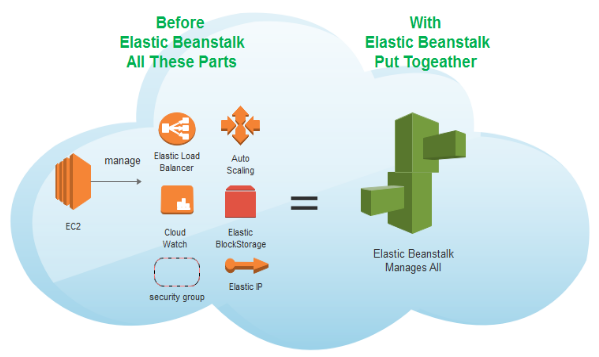
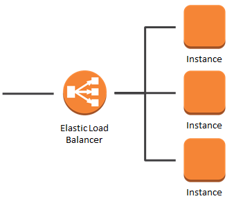
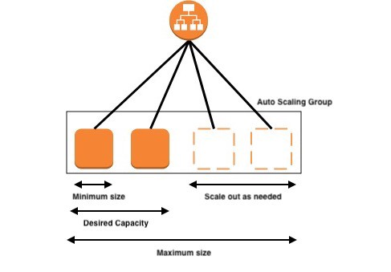

# School of AI Geneva
# How to Serve a machine learning model with AWS ElasticBeanstalk 

## Intro
In this hands-on workshop we will learn how to serve a sentiment analysis model using AWS ElasticBeanstalk 

#### What we will do:
*	Learn some basics of the AWS ecosystem
*	Learn how to deploy a basic flask app on AWS ElasticBeanstalk
*	Learn how to request your server and test your sentiment analysis model
*	Learn the difference between ElasticBeanstalk and SageMaker to serve a machine learning model. (price/ limitations / benefits).

#### Goal
At the end you will have a working server that provides sentiment analysis.

#### Pre-requisites
* An AWS account. Create an AWS account (it's free) before the meetup. Accounts are usually activated within a few minutes, but the process might take up to 24 hours. 
* Basic knowledge of Python
* Willingness to spend a few cents to use AWS resources. Please note however that AWS ElasticBeanstalk is free and other resources might fall under AWS free tier program.

## AWS Elastic Beanstalk

AWS Elastic Beanstalk is an easy-to-use service for deploying and scaling web applications and services developed with Java, .NET, PHP, Node.js, Python, Ruby, Go, and Docker on familiar servers such as Apache, Nginx, Passenger, and IIS.

Simply upload your code and Elastic Beanstalk automatically handles the deployment, from capacity provisioning, **load balancing**, **auto-scaling** to application health monitoring. At the same time, you retain full control over the AWS resources powering your application and can access the underlying resources at any time.

### Load balancer
A load balancer distributes incoming application or network traffic across multiple targets, such as Amazon EC2 instances, containers, and IP addresses, in multiple Availability Zones.

It uses health checks to detect which instances are healthy and directs traffic only across those instances.

### Autoscaling
Auto Scaling monitors your applications and automatically adjusts capacity to maintain steady, predictable performance at the lowest possible cost. 

---

Serving machine learning models with AWS ElasticBeanstalk 
A concise tutorial on how to use AWS ElasticBeanstalk to serve a multi language fastText model.

---

In this post, we demonstrate the use of AWS ElasticBeanstalk to serve multiple sentiment analysis models trained with fastText. We believe it to be one the best way to handle peak in demand and robustness, through serverless and scalability.
AWS Elastic Beanstalk

Elastic Beanstalk is an easy-to-use service for deploying and scaling web applications and services developed with Java, .NET, PHP, Node.js, Python, Ruby, Go, and Docker on familiar servers such as Apache, Nginx, Passenger, and IIS. It is an excellent choice for deploying a model as it provides scalability, monitoring while paying only the consumed resources (EC2 instances and an (optional) load balancer. Depending on the usage, it might cost you as little as 10$ per month.
TO CHECK; the excellent AWS Sagemaker server of model, uses something close to EBS but priced higher, so you migth want to check this post to see how you can save money (and check Julien Simon's great post on how to save even more on AWS sagemaker).

## Fasttext for sentiment analysis
We implement a fastText model. We believe a great choice for a production ready model. We even wrote an article - link - showing how to do that - and provide data in English, Spanish, Italian, French, German, to train your own - link -
To reproduce the model, check here: https://medium.com/@media_73863/fasttext-sentiment-analysis-for-tweets-a-straightforward-guide-9a8c070449a2
To just download files, check the GitHub page.

## Start an EBS environment
XX
## Deploy a package
XX
## Test if it works
XX
## Conclusion
Using AWS Beanstalk is an excellent way to serve a ML model. If you're already serving a model using AwS SageMaker, you might consider switching this to EBS.

