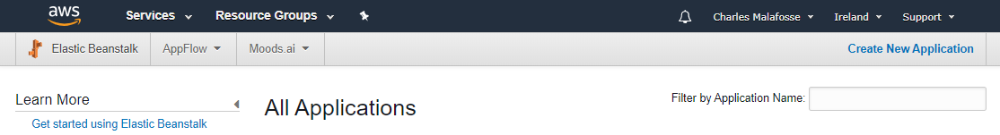
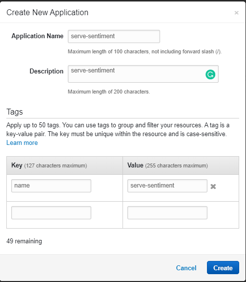
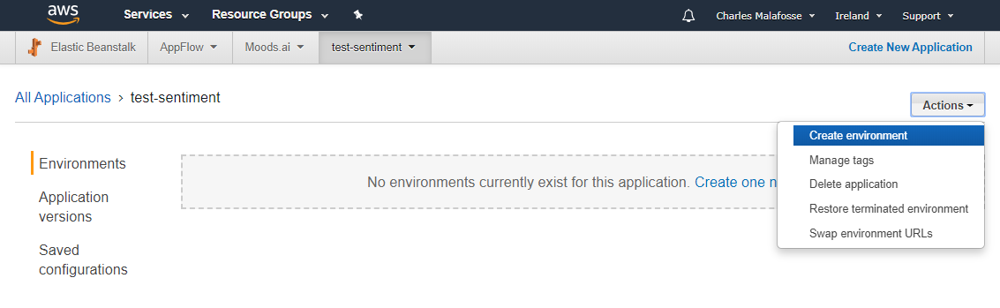
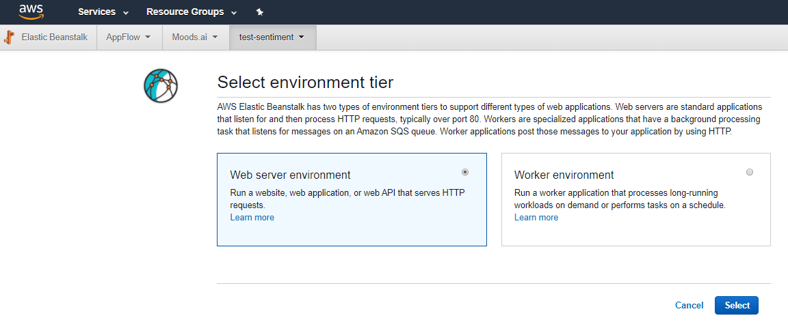
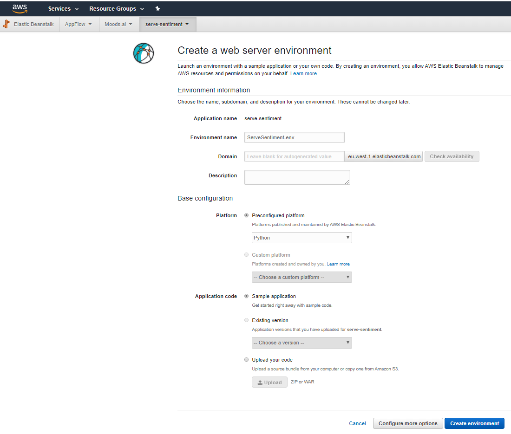

# School of AI Geneva
## How to Serve a machine learning model with AWS ElasticBeanstalk 

# Intro
In this hands-on workshop we will learn how to serve a sentiment analysis model using AWS ElasticBeanstalk 

#### What we will do:
*	Learn some basics of the AWS ecosystem
*	Learn how to deploy a basic flask app on AWS ElasticBeanstalk
*	Learn how to request your server and test your sentiment analysis model
*	Learn the difference between ElasticBeanstalk and SageMaker to serve a machine learning model. (price/ limitations / benefits).

#### Goal
At the end you will have a working server that provides sentiment analysis.

#### Pre-requisites
* :warning: An AWS account. Create an AWS account (it's free) before the meetup. Accounts are usually activated within a few minutes, but the process might take up to 24 hours. 
* Basic knowledge of Python
* Willingness to spend a few cents to use AWS resources. Please note however that AWS ElasticBeanstalk is free and other resources might fall under AWS free tier program.

# Overview of what we'll need to deploy our model

To deploy our model we will need to use:
* AWS Elastic Beanstalk, a web application deployment service 
* FastText, a Facebook Research library for text classification.
* Python, and in particular Flask, a micro web framework. It is classified as a microframework because it does not require particular tools or libraries. 


## AWS Elastic Beanstalk


AWS Elastic Beanstalk is an easy-to-use service for deploying and scaling web applications and services developed with Java, .NET, PHP, Node.js, Python, Ruby, Go, and Docker on familiar servers such as Apache, Nginx, Passenger, and IIS.

Simply upload your code and Elastic Beanstalk automatically handles the deployment, from capacity provisioning, **load balancing**, **auto-scaling** to application health monitoring. At the same time, you retain full control over the AWS resources powering your application and can access the underlying resources at any time.

:computer: **TO-DO:** Create an AWS account to access Elastic Beanstalk

### Load balancer
A load balancer distributes incoming application or network traffic across multiple targets, such as Amazon EC2 instances, containers, and IP addresses, in multiple Availability Zones.


It uses health checks to detect which instances are healthy and directs traffic only across those instances.

### Autoscaling
Auto Scaling monitors your applications and automatically adjusts capacity to maintain steady, predictable performance at the lowest possible cost. 


## FastText for Sentiment Analysis model
fastText is a library for learning of word embeddings and text classification created by Facebook's AI Research lab. It is super fast and is on par with more complex, slower algorithms.

Our model was created with the fastText library provided by Facebook Research. We believe it's great choice for a production ready model. 

This is not the goal of this tutorial but we wrote an article showing you how to do that.
To reproduce the model, check here: https://medium.com/@media_73863/fasttext-sentiment-analysis-for-tweets-a-straightforward-guide-9a8c070449a2
To download the trained models in English, French, Spanish, Italian and German, check this reporitory.

:computer: **OPTIONAL:** Install fastText on your machine if you want to run locally the python code.
:warning: :warning: To install fastText for Python, do **NOT** use "pip install". This installs an incorrect version for Windows. Install directly from the fastTest github page.
```
git clone https://github.com/facebookresearch/fastText.git
cd fastText
sudo pip install .
```

## Python micro web framework Flask
Flask is a micro web framework written in Python. It is classified as a microframework because it does not require particular tools or libraries.

Flask is very simple and perfect for our needs. For example, we only need the following lines of codes to start an "Hello World" web app.
```
from flask import Flask
app = Flask(__name__)

@app.route("/")
def hello():
    return "Hello World!"

if __name__ == "__main__":
    app.run()
```

 And it's simple to install
 ```
 pip install Flask
 ```


# Deploy on AWS ElasticBeanstalk
Now is time to use AWS ElasticBeanstalk to serve multiple sentiment analysis models trained with fastText. 

https://console.aws.amazon.com/elasticbeanstalk/

## 1- Create an App






## 2- Create an Environment
XX
## Deploy a package
XX
## Test if it works
XX
## Conclusion
Using AWS Beanstalk is an excellent way to serve a ML model. If you're already serving a model using AwS SageMaker, you might consider switching this to EBS.

:warning: DO NOT DELETE TO TERMINATE ALL THE AWS RESOURCES WE CREATED

Elastic Beanstalk is an easy-to-use service for deploying and scaling web applications and services developed with Java, .NET, PHP, Node.js, Python, Ruby, Go, and Docker on familiar servers such as Apache, Nginx, Passenger, and IIS. It is an excellent choice for deploying a model as it provides scalability, monitoring while paying only the consumed resources (EC2 instances and an (optional) load balancer. Depending on the usage, it might cost you as little as 10$ per month.
TO CHECK; the excellent AWS Sagemaker server of model, uses something close to EBS but priced higher, so you migth want to check this post to see how you can save money (and check Julien Simon's great post on how to save even more on AWS sagemaker).

