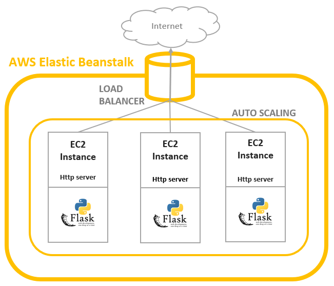
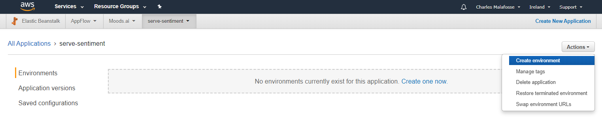
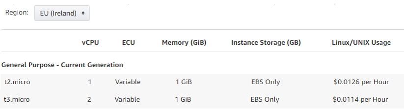
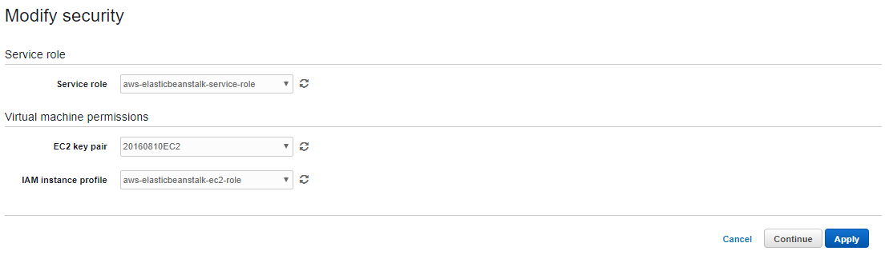
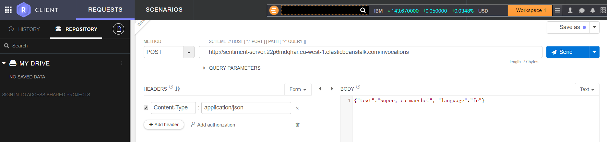

# School of AI Geneva
## How to Serve a machine learning model with AWS ElasticBeanstalk 


# Intro
In this hands-on workshop we will learn how to serve a sentiment analysis model using AWS ElasticBeanstalk 


#### What we will do:
*	Learn some basics of the AWS ecosystem
*	Learn how to deploy a basic flask app on AWS ElasticBeanstalk
*	Learn how to request your server and test your sentiment analysis model
*	Learn the difference between ElasticBeanstalk and Amazon SageMaker to serve a machine learning model. (price/ limitations / benefits).


#### Goal
At the end you will have a working server that provides on-demand sentiment analysis.


#### Pre-requisites
* :warning: An AWS account. Create an AWS account (it's free) before the meetup. Accounts are usually activated within a few minutes, but the process might take up to 24 hours. 
* Basic knowledge of Python
* Willingness to spend a few cents to use AWS resources. Please note however that AWS ElasticBeanstalk is free, you pay for AWS resources (e.g. EC2 instances or S3 buckets), and they might fall under AWS free tier program.


# Overview of what we'll need to deploy our model

To deploy our model we will need to use:
* AWS Elastic Beanstalk, a web application deployment service 
* FastText, a Facebook Research library for text classification.
* Python, and in particular Flask, a micro web framework. It is classified as a microframework because it does not require particular tools or libraries. 




## AWS Elastic Beanstalk


AWS Elastic Beanstalk is an easy-to-use service for deploying and scaling web applications and services developed with Java, .NET, PHP, Node.js, Python, Ruby, Go, and Docker on familiar servers such as Apache, Nginx, Passenger, and IIS.

Simply upload your code and Elastic Beanstalk automatically handles the deployment, from capacity provisioning, **load balancing**, **auto-scaling** to application health monitoring. At the same time, you retain full control over the AWS resources powering your application and can access the underlying resources at any time.


:computer: **TO-DO:** Create an AWS account to access Elastic Beanstalk


### Load balancer
A load balancer distributes incoming application or network traffic across multiple targets, such as Amazon EC2 instances, containers, and IP addresses, in multiple Availability Zones.


It uses health checks to detect which instances are healthy and directs traffic only across those instances.


### Autoscaling
Auto Scaling monitors your applications and automatically adjusts capacity to maintain steady, predictable performance at the lowest possible cost. 


## FastText for Sentiment Analysis model
fastText is a library for learning of word embeddings and text classification created by Facebook's AI Research lab. It is super fast and is on par with more complex, slower algorithms.

Our model was created with the fastText library provided by Facebook Research. We believe it's great choice for a production ready model. 

This is not the goal of this tutorial but we wrote an article showing you how to do that.
To reproduce the model, check here: https://medium.com/@charlesmalafosse/fasttext-sentiment-analysis-for-tweets-a-straightforward-guide-9a8c070449a2
To download the trained models in English, French, Spanish, Italian and German, check this GitHub reporitory.


:computer: **OPTIONAL:** Install fastText on your machine if you want to run locally the python code.


:warning: :warning: To install fastText for Python, do **NOT** use "pip install". This installs an incorrect version for Windows.


Install directly from the fastTest github page.
```
git clone https://github.com/facebookresearch/fastText.git
cd fastText
sudo pip install .
```


## Python micro web framework Flask
Flask is a micro web framework written in Python. It is classified as a microframework because it does not require particular tools or libraries.

Flask is very simple and perfect for our needs. For example, we only need the following lines of codes to start an "Hello World" web app.
```
from flask import Flask
app = Flask(__name__)

@app.route("/")
def hello():
    return "Hello World!"

if __name__ == "__main__":
    app.run()
```


 And it's simple to install
 ```
 pip install Flask
 ```


# Deploy on AWS ElasticBeanstalk
Now is time to use AWS ElasticBeanstalk to serve multiple sentiment analysis models trained with fastText. 

https://console.aws.amazon.com/elasticbeanstalk/


## 1- Create an App

First we need to **create an App**. An Elastic Beanstalk App is a logical collection of Elastic Beanstalk components, including environments, versions, and environment configurations. In Elastic Beanstalk an application is conceptually **similar to a folder**.


## 2- Create an Environment

Now we need to create an environment. An environment is a collection of AWS resources running an application version. Each environment runs only one application version at a time, however, you can run the same application version or different application versions in many environments simultaneously. 

:grey_exclamation: When you create an environment, Elastic Beanstalk provisions the resources needed to run the application version you specified.




Select **Web Server Environment**.

Web Servers Env run web server processes (apache, nginx, etc). While Worker environment deal with long-running processes and communicate with AWS SQS.


A platform is a combination of an operating system, programming language runtime, web server, application server, and Elastic Beanstalk components.

Select **Python** for platform.


Configurations. 


#### Modify Instance to T3 Micro
T3 is a newer and cheaper version than the T2 proposed by default. 


On the "Instances" configuration page, specify the instance type and specify a custom AMI (Amazon Machine Images) if necessary. 


#### Modify Security (optional) 
Should you need to test anything on your EC2 instances, you might want to specify an EC2 Key pair. These keys are required to be able to connect to your instance. You might also have to check that the security Group linked to your instances allows external connections.


More information here: https://docs.aws.amazon.com/AWSEC2/latest/UserGuide/ec2-key-pairs.html



#### Modify Scalability
We will the Scalability configuration unchanged. Our autoscaling will have a min of 1 instance and up to 4 depending. The number of instances is by a metric that can be modified on this configuration screen.

Instance metrics provide information about the health of instances in your environment. The Elastic Beanstalk health agent runs on each instance. It gathers and relays metrics about instances to Elastic Beanstalk, which analyzes the metrics to determine the health of the instances in your environments.

https://docs.aws.amazon.com/AWSEC2/latest/UserGuide/viewing_metrics_with_cloudwatch.html


#### Create the Environment
Click on [Create Environment] to start provisioning the resources necessary:
* An EC2 instance with a running web server and a Flask app.
* An Autoscaling group
* A Load Balancer
These can be seen on the EC2 console: https://eu-west-1.console.aws.amazon.com/ec2/


## Deploy our own Package
We just deployed an elastic Beanstalk sample app. Now we will replace this package with our own.


Our package contains:
* a python file application.py, this contains our Flask app.
* A folder '.ebextensions' with Elastic Beanstalk config files.
    * A file '00_application.config': This will be executed before our instance is running.
    * A file '01_pip-install.config': This will be executed after our instance is running and will create our python environment.


### Flask App
Our flask app is contained in the application.py file (on this github repository).

It has the following functions:
* hello(): Root route '/'. For test only.
* ping(): Determine if the container is working and healthy. In this sample container, we declare
    it healthy if we can load the model successfully.
* transformation(): Inference on a single batch of data
* Other functions deals with text cleaning.


At start, application.py downloads the models from GitHub and store them on the EC2 instance.

The app starts with the following command: 
 ```
if __name__ == '__main__':
    application.run()
 ```
 
 
 
### EB Config files
You can add AWS Elastic Beanstalk configuration files (.ebextensions) to your web application's source code to configure your environment and customize the AWS resources that it contains. 
Our folder '.ebextensions' contains these 2 files:


* 00_application.config
```
commands:
  01_dev_tools:
    command: sudo yum groupinstall -y "Development Tools"
  02_dev_libs:
    command: sudo yum groupinstall -y "Development Libraries"
  03_gcc_alternatives:
    command: sudo alternatives --set gcc "/usr/bin/gcc48"
```


* 01_pip-install.config
```
files:
  "/tmp/pipInstallation.sh":
    mode: "000777"
    owner: root
    group: root
    content: |
      #! /bin/bash
      source /opt/python/run/venv/bin/activate
      pip install beautifulsoup4==4.7.1
      pip install boto3==1.9.86
... (check github files for complete list)
      pip install Werkzeug==0.14.1
      git clone https://github.com/facebookresearch/fastText.git
      cd fastText
      pip install .

commands:
  01_execute:
    command: "/tmp/pipInstallation.sh"
```


### Zip it and upload/deploy
On your app environment, click on [Update and Deploy], and upload the zip file containing the application.py and the .ebextensions folder. 


## Test if it works
To test if our model is correctly deployed, simply navigate to the endpoint of the environment. For instance : ServeSentiment-env.qnmpdqf6re.eu-west-1.elasticbeanstalk.com 


You should see: "Welcome to your Sentiment Analysis Tool".


Finally to test our model we will use a POST method on the resource "/invocations" defined in our Flask app. Make sure you pass the following payload: 
```
    {text:"This is great!",language:"US"}
```


We use the Restlet Chrome extension to test our endpoint:


You should see the result with an HTTP response 200.


## ElasticBeanstalk Vs. SageMaker

### Amazon SageMaker
What is SageMaker? Amazon SageMaker is a cloud machine-learning platform that was launched in November 2017. SageMaker enables developers to create, train, and **deploy** machine-learning models in the cloud.


Using AWS Beanstalk is an excellent way to serve a ML model. You get scalability at a very affordable cost. If you're already serving a model using AWS SageMaker, you might consider switching this to EBS to save money.


### Pros and Cons of using Elastic Beanstalk for serving ML models


#### Pros:
* Cheaper: Smallest instance is 10$ a month vs. 50$ for SageMaker.
* More customization vs. SageMaker. You control and have access to all the underlying resources.
* You can bring any ML models.
#### Cons:
* SageMaker is easier to deploy. Fully managed, no need to bother with underlying resources and their configuration.
* Faster if you trained in SageMaker and used estimators. Literally just one line of code.

## That's it - Time to delete the resources created


### :warning: DO NOT FORGET TO TERMINATE THE AWS RESOURCES WE CREATED :warning: 
* Delete AWS ElasticBeanstalk app. This will also delete the EC2 instance creted.
* Delete S3 bucket

## Thanks!
